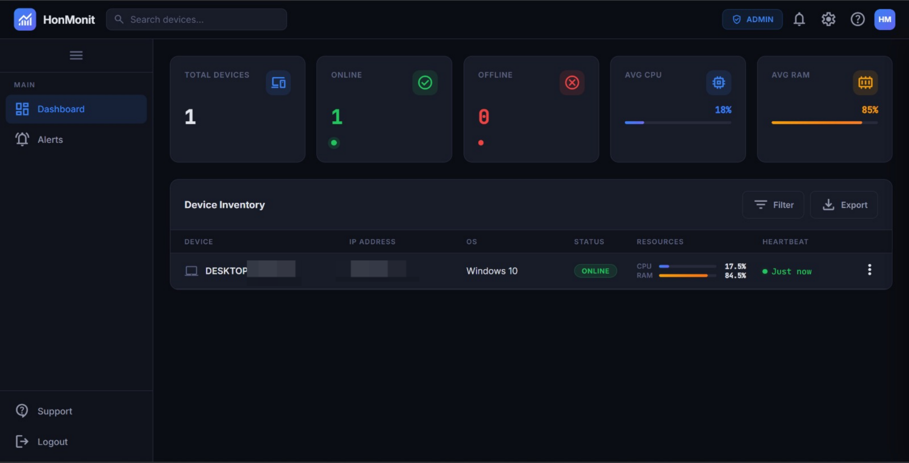
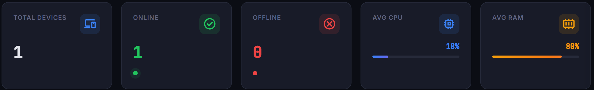
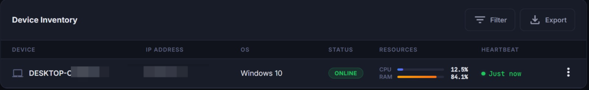
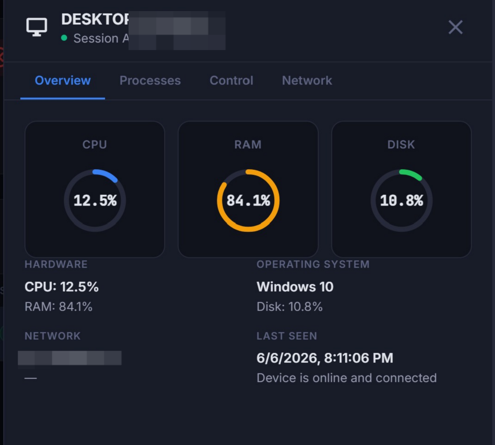
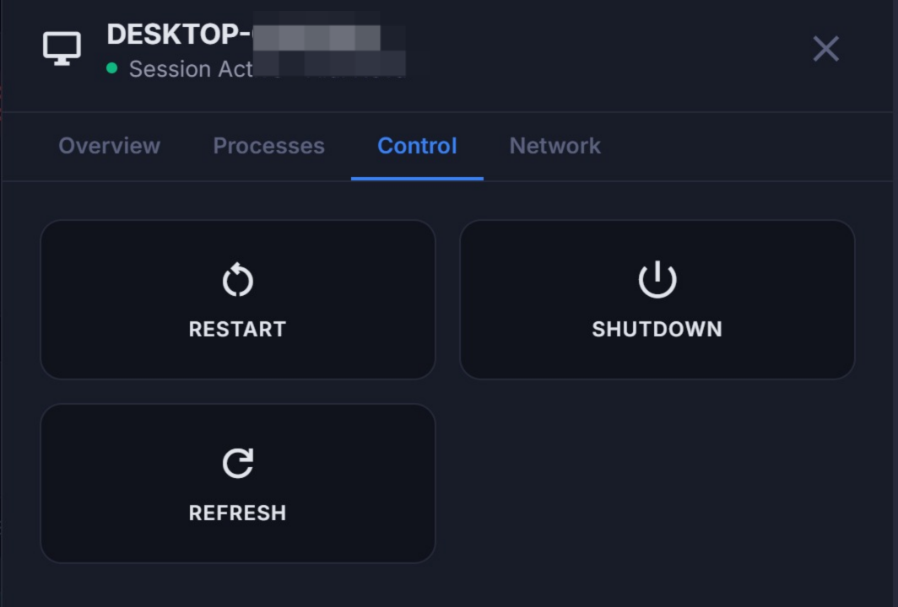

# Screenshots

> HonMonit is a dark‑theme dashboard. Screenshots are available in the [`img/`](../img) directory.

---

## Dashboard — Device Inventory

The main view with summary stat cards and the device table.

---

## Stat Cards

Aggregate statistics header showing total devices, online/offline counts, and average CPU/RAM.

---

## Device Inventory Table

Filterable, searchable table of all monitored devices with CPU, RAM, status, and heartbeat columns.

---

## Detail Panel — Overview

Slide‑out side panel showing CPU, RAM, and disk gauges plus hardware, OS, and network info.

---

## Detail Panel — Control

Remote command controls for restart and shutdown (visible only in Admin mode).

---

> Additional screenshots can be added to the [`img/`](../img) folder and referenced using the same `` pattern.
